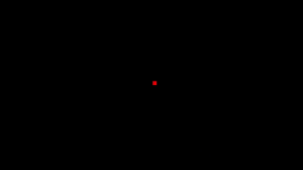
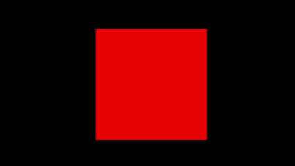
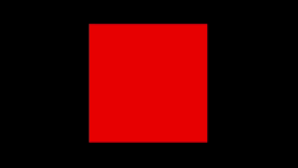
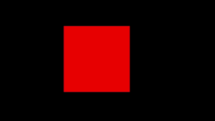
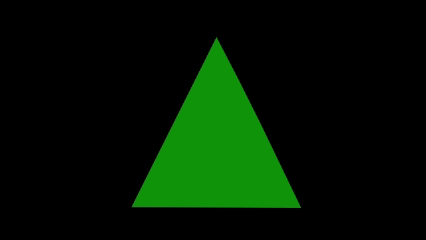
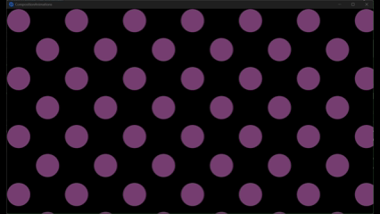
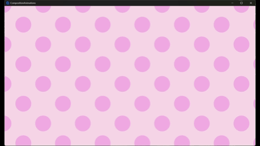
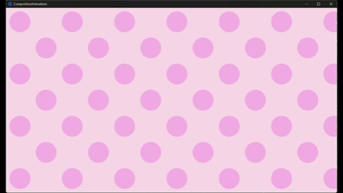

<h1 align="center">
  Handy Avalonia Bits
</h1>

<p align="center">
  Handy Avalonia Bits contains various specks that make building in Avalonia a tad easier
</p>


## 🔍 What is this for?

Handy Avalonia Bits continuously adds features to make developing certain things in Avalonia easier.

There is not strict theme or policy; if it's Avalonia and helpful it belongs here.

Take a look at some features below to get an idea of what there currently is.

## ✨ Top Features

### 🎨 Composition Animations in axaml

The compositor in Avalonia allows you to utilise the GPU to run animations, which provides a heavy performance boost.
\
Although, the compositor requires C# code-behind rather than axaml, which introduces bloat classes that need to be organised for every animation in your project.

If you prefer keeping all UI logic, including animations, in your axaml then HandyAvaloniaBits lets you do just that.

```xml
<UserControl xmlns="https://github.com/avaloniaui"
             xmlns:x="http://schemas.microsoft.com/winfx/2006/xaml"
             xmlns:d="http://schemas.microsoft.com/expression/blend/2008"
             xmlns:mc="http://schemas.openxmlformats.org/markup-compatibility/2006"
             xmlns:viewmodels="using:CompositionAnimations.ViewModels"
             
             xmlns:behaviour="using:HandyAvaloniaBits.Animations.Composition.Discrete.Behaviour"
             xmlns:animationsegment="using:HandyAvaloniaBits.Animations.Composition.Discrete.AnimationSegment"
             xmlns:discretePropertyGroup="using:HandyAvaloniaBits.Animations.Composition.Discrete.PropertyGroup.Implementations"
             xmlns:dkf="using:HandyAvaloniaBits.Animations.Composition.Discrete.KeyFrame.Implementations"
             
             mc:Ignorable="d" d:DesignWidth="800" d:DesignHeight="450"
             x:Class="CompositionAnimations.Views.ExamplesView"
             x:DataType="viewmodels:ExamplesViewModel">
    <Rectangle Fill="Red"
               Width="200"
               Height="200"
               behaviour:TriggerAnimationBehaviour.DeferEnabled="True"
               behaviour:TriggerAnimationBehaviour.Iterations="Infinite">

        <behaviour:TriggerAnimationBehaviour.OnTrigger>

            <!--
                TriggerAnimationBehaviour.OnTrigger is a list of segments.
                Animations can be split into many segments that can have different cancelations or properties.
            -->

            <animationsegment:CompositionAnimationSegment TriggerDuration="0:0:2.5">
                
                <!--
                    The TriggerGroup contains the different key frames.
                    Here are scale, rotation and quaternion key frames as an example.
                -->

                <animationsegment:CompositionAnimationSegment.TriggerGroup>
                    <discretePropertyGroup:ScalePropertyGroup>
                        <discretePropertyGroup:ScalePropertyGroup.ScaleKeyFrames>
                            <dkf:ScaleKeyFrame Time="0:0:0" Scale="0,0,0"/>
                            <dkf:ScaleKeyFrame Time="0:0:.4" Scale="1,1,1" Easing=".48,0 .52,1.4"/>
                            <dkf:ScaleKeyFrame Time="0:0:.8" Scale=".95,.95,.95"/>
                            <dkf:ScaleKeyFrame Time="0:0:1.2" Scale="1,1,1"/>
                            <dkf:ScaleKeyFrame Time="0:0:1.8" Scale=".2,.2,.2" Easing=".48,0 .52,1.4"/>
                            <dkf:ScaleKeyFrame Time="0:0:2.3" Scale="1,1,1" Easing=".48,0 .52,1.4"/>
                        </discretePropertyGroup:ScalePropertyGroup.ScaleKeyFrames>
                    </discretePropertyGroup:ScalePropertyGroup>

                    <discretePropertyGroup:RotationPropertyGroup>
                        <discretePropertyGroup:RotationPropertyGroup.RotationKeyFrames>
                            <dkf:RotationKeyFrame Time="0:0:0" Degrees="0"/>
                            <dkf:RotationKeyFrame Time="0:0:1" Degrees="0"/>
                            <dkf:RotationKeyFrame Time="0:0:2.4" Degrees="360" Easing=".48,-.4 .52,1"/>
                        </discretePropertyGroup:RotationPropertyGroup.RotationKeyFrames>
                    </discretePropertyGroup:RotationPropertyGroup>

                    <discretePropertyGroup:QuaternionPropertyGroup>
                        <discretePropertyGroup:QuaternionPropertyGroup.QuaternionKeyFrames>
                            <dkf:QuaternionKeyFrame Time="0:0:0" Direction="1,0,0" Angle="0"/>
                            <dkf:QuaternionKeyFrame Time="0:0:1" Direction="1,0,0" Angle="0"/>
                            <dkf:QuaternionKeyFrame Time="0:0:1.75" Direction="1,1,0" Angle="1.2"/>
                            <dkf:QuaternionKeyFrame Time="0:0:2.5" Direction="1,0,0" Angle="0"/>
                        </discretePropertyGroup:QuaternionPropertyGroup.QuaternionKeyFrames>
                    </discretePropertyGroup:QuaternionPropertyGroup>
                </animationsegment:CompositionAnimationSegment.TriggerGroup>

            </animationsegment:CompositionAnimationSegment>
        </behaviour:TriggerAnimationBehaviour.OnTrigger>
    </Rectangle>
</UserControl>
```




Continuous animations are also suported, such as one using the cursor.

```xml
<UserControl xmlns="https://github.com/avaloniaui"
             xmlns:x="http://schemas.microsoft.com/winfx/2006/xaml"
             xmlns:d="http://schemas.microsoft.com/expression/blend/2008"
             xmlns:mc="http://schemas.openxmlformats.org/markup-compatibility/2006"
             xmlns:viewmodels="using:CompositionAnimations.ViewModels"
             
             xmlns:continuousBehaviour="using:HandyAvaloniaBits.Animations.Composition.Continuous.Behaviour"
             xmlns:cmpgs="using:HandyAvaloniaBits.Animations.Composition.Continuous.PropertyGroup.Implementations"
             xmlns:rpm="using:HandyAvaloniaBits.Animations.Composition.Continuous.PropertyGroup.PointerMaps.Rotation.Implementations"

             mc:Ignorable="d" d:DesignWidth="800" d:DesignHeight="450"
             x:Class="CompositionAnimations.Views.ExamplesView"
             x:DataType="viewmodels:ExamplesViewModel">

    <Rectangle Fill="Red"
               Width="200"
               Height="200"
               continuousBehaviour:PointerAnimationBehaviour.Enabled="True">
        
        <continuousBehaviour:PointerAnimationBehaviour.Expressions>
            <cmpgs:ImplicitRotationPropertyGroup>
                <cmpgs:ImplicitRotationPropertyGroup.PointerMap>
                    <rpm:RotateToPointer Center="100,100" Offset="-90"/>
                </cmpgs:ImplicitRotationPropertyGroup.PointerMap>
            </cmpgs:ImplicitRotationPropertyGroup>
        </continuousBehaviour:PointerAnimationBehaviour.Expressions>

    </Rectangle>

</UserControl>
```




The `PointerAnimationBehaviour` above uses the Control's bounds to animate to the cursor, if your animation uses transforms such as rotation this can cause inconsistent movement as shown below.



Use the `PointerAnimationCanvas` to define a static bound for the cursor, it also allows more complex animations using different `PointerTargets` that animate different things within the pointer canvas.

```xml
<UserControl xmlns="https://github.com/avaloniaui"
             xmlns:x="http://schemas.microsoft.com/winfx/2006/xaml"
             xmlns:d="http://schemas.microsoft.com/expression/blend/2008"
             xmlns:mc="http://schemas.openxmlformats.org/markup-compatibility/2006"
             xmlns:viewmodels="using:CompositionAnimations.ViewModels"
             
             xmlns:pointerControls="using:HandyAvaloniaBits.Animations.Composition.Continuous.Pointer.Controls"
             xmlns:pointerBound="using:HandyAvaloniaBits.Animations.Composition.Continuous.Pointer.Bound"
             xmlns:cmpgs="using:HandyAvaloniaBits.Animations.Composition.Continuous.PropertyGroup.Implementations"
             xmlns:orpms="using:HandyAvaloniaBits.Animations.Composition.Continuous.PropertyGroup.PointerMaps.Orientation.Implementations"
             xmlns:ckf="using:HandyAvaloniaBits.Animations.Composition.Continuous.KeyFrame"
             xmlns:oppms="using:HandyAvaloniaBits.Animations.Composition.Continuous.PropertyGroup.PointerMaps.Opacity.Implementations"

             mc:Ignorable="d" d:DesignWidth="800" d:DesignHeight="450"
             x:Class="CompositionAnimations.Views.ExamplesView"
             x:DataType="viewmodels:ExamplesViewModel">
    
    <!--
        A PointerAnimationCanvas contains many PointerBounds respond to the cursor,
        and many PointerTargets which are animated from one or many PointerBounds.
    -->
    <pointerControls:PointerAnimationCanvas Height="200" Width="200">

        <!--
            This canvas uses one PointerBound that is the size of the canvas.
            A PointerBound has to be in front of the targets: make sure it has a higher ZIndex.
            You can change the Fill of the geometry to see the bounds: good for debugging.
        -->
        <pointerControls:PointerAnimationCanvas.PointerBoundsPool>
            <pointerBound:PointerAnimationBound>
				<pointerBound:PointerAnimationBound.Bounds>
			        <Rectangle Fill="Transparent" ZIndex="1"
                               Width="200" Height="200"/>
                </pointerBound:PointerAnimationBound.Bounds>
            </pointerBound:PointerAnimationBound>
        </pointerControls:PointerAnimationCanvas.PointerBoundsPool>
        
		<pointerControls:PointerAnimationCanvas.PointerTargets>

            <!--
                Pointer target for red square in bottom right corner
            -->
			<pointerControls:PointerAnimationTarget Duration="0:0:.5">

                <pointerControls:PointerAnimationTarget.Content>
                    <Rectangle Fill="Red" Opacity="0" Height="200" Width="200"/>
                </pointerControls:PointerAnimationTarget.Content>

                <pointerControls:PointerAnimationTarget.Expressions>
                    <cmpgs:ImplicitOrientationPropertyGroup>
						<cmpgs:ImplicitOrientationPropertyGroup.PointerMap>
							<orpms:OrientateToPointer Center="100,100" MaxTiltDegrees="45" Size="200,200"/>
                        </cmpgs:ImplicitOrientationPropertyGroup.PointerMap>
                        <cmpgs:ImplicitOrientationPropertyGroup.KeyFrames>
							<ckf:ImplicitCompositionKeyFrame Progress="1" Value="this.FinalValue" Easing=".4,4 .7,.5"/>
                        </cmpgs:ImplicitOrientationPropertyGroup.KeyFrames>
                    </cmpgs:ImplicitOrientationPropertyGroup>

                    <cmpgs:ImplicitOpacityPropertyGroup>
						<cmpgs:ImplicitOpacityPropertyGroup.PointerMap>
							<oppms:DarkenOpacityInRadius Center="166,166" RadiusX="100" RadiusY="100"/>
                        </cmpgs:ImplicitOpacityPropertyGroup.PointerMap>
                    </cmpgs:ImplicitOpacityPropertyGroup>
                </pointerControls:PointerAnimationTarget.Expressions>

            </pointerControls:PointerAnimationTarget>

            <!--
                Pointer target for green triangle in top left corner
            -->
            <pointerControls:PointerAnimationTarget Duration="0:0:.5">

                <pointerControls:PointerAnimationTarget.Content>
                    <Path Fill="Green" Width="200" Height="200" Opacity="0" Data="M0,200 L100,0 200,200Z"/>
                </pointerControls:PointerAnimationTarget.Content>

                <pointerControls:PointerAnimationTarget.Expressions>
                    <cmpgs:ImplicitOrientationPropertyGroup>
						<cmpgs:ImplicitOrientationPropertyGroup.PointerMap>
							<orpms:OrientateToPointer Center="100,100" MaxTiltDegrees="45" Size="200,200"/>
                        </cmpgs:ImplicitOrientationPropertyGroup.PointerMap>
                        <cmpgs:ImplicitOrientationPropertyGroup.KeyFrames>
							<ckf:ImplicitCompositionKeyFrame Progress="1" Value="this.FinalValue" Easing=".4,4 .7,.5"/>
                        </cmpgs:ImplicitOrientationPropertyGroup.KeyFrames>
                    </cmpgs:ImplicitOrientationPropertyGroup>

                    <cmpgs:ImplicitOpacityPropertyGroup>
						<cmpgs:ImplicitOpacityPropertyGroup.PointerMap>
							<oppms:DarkenOpacityInRadius Center="33,33" RadiusX="100" RadiusY="100"/>
                        </cmpgs:ImplicitOpacityPropertyGroup.PointerMap>
                    </cmpgs:ImplicitOpacityPropertyGroup>
                </pointerControls:PointerAnimationTarget.Expressions>

            </pointerControls:PointerAnimationTarget>

            <!--
                Pointer target for pink pentagon in bottom left corner
            -->
            <pointerControls:PointerAnimationTarget Duration="0:0:.5">

                <pointerControls:PointerAnimationTarget.Content>
                    <Path Fill="HotPink" Width="200" Height="200" Opacity="0" Data="M100,0 L200,100 147,200 53,200 0,100Z"/>
                </pointerControls:PointerAnimationTarget.Content>

                <pointerControls:PointerAnimationTarget.Expressions>
                    <cmpgs:ImplicitOrientationPropertyGroup>
						<cmpgs:ImplicitOrientationPropertyGroup.PointerMap>
							<orpms:OrientateToPointer Center="100,100" MaxTiltDegrees="45" Size="200,200"/>
                        </cmpgs:ImplicitOrientationPropertyGroup.PointerMap>
                        <cmpgs:ImplicitOrientationPropertyGroup.KeyFrames>
							<ckf:ImplicitCompositionKeyFrame Progress="1" Value="this.FinalValue" Easing=".4,4 .7,.5"/>
                        </cmpgs:ImplicitOrientationPropertyGroup.KeyFrames>
                    </cmpgs:ImplicitOrientationPropertyGroup>

                    <cmpgs:ImplicitOpacityPropertyGroup>
						<cmpgs:ImplicitOpacityPropertyGroup.PointerMap>
							<oppms:DarkenOpacityInRadius Center="33,166" RadiusX="100" RadiusY="100"/>
                        </cmpgs:ImplicitOpacityPropertyGroup.PointerMap>
                    </cmpgs:ImplicitOpacityPropertyGroup>
                </pointerControls:PointerAnimationTarget.Expressions>

            </pointerControls:PointerAnimationTarget>

            <!--
                Pointer target for purple hexagon in top right corner
            -->
            <pointerControls:PointerAnimationTarget Duration="0:0:.5">

                <pointerControls:PointerAnimationTarget.Content>
                    <Path Fill="Purple" Width="200" Height="200" Opacity="0" Data="M50,0 H150 L200,100 150,200 H50 L0,100Z"/>
                </pointerControls:PointerAnimationTarget.Content>

                <pointerControls:PointerAnimationTarget.Expressions>
                    <cmpgs:ImplicitOrientationPropertyGroup>
						<cmpgs:ImplicitOrientationPropertyGroup.PointerMap>
							<orpms:OrientateToPointer Center="100,100" MaxTiltDegrees="45" Size="200,200"/>
                        </cmpgs:ImplicitOrientationPropertyGroup.PointerMap>
                        <cmpgs:ImplicitOrientationPropertyGroup.KeyFrames>
							<ckf:ImplicitCompositionKeyFrame Progress="1" Value="this.FinalValue" Easing=".4,4 .7,.5"/>
                        </cmpgs:ImplicitOrientationPropertyGroup.KeyFrames>
                    </cmpgs:ImplicitOrientationPropertyGroup>

                    <cmpgs:ImplicitOpacityPropertyGroup>
						<cmpgs:ImplicitOpacityPropertyGroup.PointerMap>
							<oppms:DarkenOpacityInRadius Center="166,3" RadiusX="100" RadiusY="100"/>
                        </cmpgs:ImplicitOpacityPropertyGroup.PointerMap>
                    </cmpgs:ImplicitOpacityPropertyGroup>
                </pointerControls:PointerAnimationTarget.Expressions>

            </pointerControls:PointerAnimationTarget>
        </pointerControls:PointerAnimationCanvas.PointerTargets>

    </pointerControls:PointerAnimationCanvas>

</UserControl>

```


Ever wanted to cancel an animation differently depending on what stage it is in? Now you can.

```xml
<UserControl xmlns="https://github.com/avaloniaui"
             xmlns:x="http://schemas.microsoft.com/winfx/2006/xaml"
             xmlns:d="http://schemas.microsoft.com/expression/blend/2008"
             xmlns:mc="http://schemas.openxmlformats.org/markup-compatibility/2006"
             xmlns:viewmodels="using:CompositionAnimations.ViewModels"
             
             xmlns:animationsegment="using:HandyAvaloniaBits.Animations.Composition.Discrete.AnimationSegment"
             xmlns:discreteB="using:HandyAvaloniaBits.Animations.Composition.Discrete.Behaviour"
             xmlns:discretePropertyGroup="using:HandyAvaloniaBits.Animations.Composition.Discrete.PropertyGroup.Implementations"
             xmlns:dkf="using:HandyAvaloniaBits.Animations.Composition.Discrete.KeyFrame.Implementations"
             
             mc:Ignorable="d" d:DesignWidth="800" d:DesignHeight="450"
             x:Class="CompositionAnimations.Views.ExamplesView"
             x:DataType="viewmodels:ExamplesViewModel">

    <Rectangle Fill="Red" Height="200" Width="200"
               discreteB:TriggerAnimationBehaviour.Iterations="5">
                
        <discreteB:TriggerAnimationBehaviour.OnTrigger>

            <!--
                Segments can be used to split up complex animations.
                Each segment can have it's own cancel group.
            -->
            <animationsegment:CompositionAnimationSegment TriggerDuration="0:0:1"
                                                          CancelDuration="0:0:1">

                <!--
                    Rotate rectangle
                -->
                <animationsegment:CompositionAnimationSegment.TriggerGroup>
                    <discretePropertyGroup:RotationPropertyGroup>
                        <discretePropertyGroup:RotationPropertyGroup.RotationKeyFrames>
                            <dkf:RotationKeyFrame Time="100%" Degrees="360" Easing=".2,-.4 .8,1.4"/>
                            <dkf:RotationKeyFrame Time="100%" Degrees="0"/>
                        </discretePropertyGroup:RotationPropertyGroup.RotationKeyFrames>
                    </discretePropertyGroup:RotationPropertyGroup>
                </animationsegment:CompositionAnimationSegment.TriggerGroup>

                <!--
                    If cancelled, rotate back
                -->
                <animationsegment:CompositionAnimationSegment.CancelGroup>
                    <discretePropertyGroup:RotationPropertyGroup>
						<discretePropertyGroup:RotationPropertyGroup.RotationKeyFrames>
                            <dkf:RotationKeyFrame Time="100%" Degrees="0" Easing=".2,.8 .8,1.2"/>
                        </discretePropertyGroup:RotationPropertyGroup.RotationKeyFrames>
                    </discretePropertyGroup:RotationPropertyGroup>
                </animationsegment:CompositionAnimationSegment.CancelGroup>

            </animationsegment:CompositionAnimationSegment>

            <animationsegment:CompositionAnimationSegment TriggerDuration="0:0:2"
                                                          CancelDuration="0:0:1">

                <!--
                    Grow rectangle
                -->
                <animationsegment:CompositionAnimationSegment.TriggerGroup>
                    <discretePropertyGroup:ScalePropertyGroup>
						<discretePropertyGroup:ScalePropertyGroup.ScaleKeyFrames>
							<dkf:ScaleKeyFrame Time="100%" Scale="2,2,1" Easing=".2,-.4 .8,1.4"/>
                        </discretePropertyGroup:ScalePropertyGroup.ScaleKeyFrames>
                    </discretePropertyGroup:ScalePropertyGroup>
                </animationsegment:CompositionAnimationSegment.TriggerGroup>

                <!--
                    If cancelled, shrink back
                -->
                <animationsegment:CompositionAnimationSegment.CancelGroup>
                    <discretePropertyGroup:ScalePropertyGroup>
						<discretePropertyGroup:ScalePropertyGroup.ScaleKeyFrames>
							<dkf:ScaleKeyFrame Time="100%" Scale="1,1,1" Easing=".2,-.7 .8,1.4"/>
                        </discretePropertyGroup:ScalePropertyGroup.ScaleKeyFrames>
                    </discretePropertyGroup:ScalePropertyGroup>
                </animationsegment:CompositionAnimationSegment.CancelGroup>

            </animationsegment:CompositionAnimationSegment>

            <animationsegment:CompositionAnimationSegment TriggerDuration="0:0:1">

                <!--
                    Finally, Shrink rectangle
                -->
                <animationsegment:CompositionAnimationSegment.TriggerGroup>
                    <discretePropertyGroup:ScalePropertyGroup>
						<discretePropertyGroup:ScalePropertyGroup.ScaleKeyFrames>
							<dkf:ScaleKeyFrame Time="100%" Scale="1,1,1" Easing=".2,.5 .8,1.4"/>
                        </discretePropertyGroup:ScalePropertyGroup.ScaleKeyFrames>
                    </discretePropertyGroup:ScalePropertyGroup>
                </animationsegment:CompositionAnimationSegment.TriggerGroup>

                <!--
                    No cancellation needed for this segmnet since it already shrinks back
                -->

            </animationsegment:CompositionAnimationSegment>
        </discreteB:TriggerAnimationBehaviour.OnTrigger>

        <Rectangle.Styles>
			<Style Selector="Rectangle:pointerover">
				<Setter Property="discreteB:TriggerAnimationBehaviour.Enabled" Value="True"/>
            </Style>
        </Rectangle.Styles>

    </Rectangle>

</UserControl>
```



### ⚙ Geometry Morph Animator

HandyAvaloniaBits includes a simple geometry animator, so that you can create basic shape morphs with little effort.

First, add the Animator to your project. You can do this by using the extension on `AppBuilder` in `Program.cs` to keep things cleaner.

```csharp
public static AppBuilder BuildAvaloniaApp() =>
    AppBuilder.Configure<App>()
        .UsePlatformDetect()
        .WithInterFont()
        .LogToTrace()
        .UseReactiveUI(builder => builder.WithAvalonia())
        .UseExtensionsAnimators(); // sets up morph animator
```

Just create your path geometries and let the animator do the work.

> [!NOTE]
> If your geometries have different numbers of segments, the animator will bisect segments untill the segments match.
> \
> To have full control over which points morph where, design your geometries so that the number of segments match.

```xml
<UserControl xmlns="https://github.com/avaloniaui"
             xmlns:x="http://schemas.microsoft.com/winfx/2006/xaml"
             xmlns:d="http://schemas.microsoft.com/expression/blend/2008"
             xmlns:mc="http://schemas.openxmlformats.org/markup-compatibility/2006"
             xmlns:viewmodels="using:CompositionAnimations.ViewModels"
             mc:Ignorable="d" d:DesignWidth="800" d:DesignHeight="450"
             x:Class="CompositionAnimations.Views.ExamplesView"
             x:DataType="viewmodels:ExamplesViewModel">

    <UserControl.Resources>
        <PathGeometry x:Key="triangle">
            M100,0
            L200,200
            H0Z
        </PathGeometry>
        <PathGeometry x:Key="rectangle">
            M0,0 
            H200
            V200
            H0Z
        </PathGeometry>
        <PathGeometry x:Key="pentagon">
            M100,0
            L200,100
            147,200
            53,200
            0,100Z
        </PathGeometry>
        <PathGeometry x:Key="hexagon">
            M50,0
            H150
            L200,100
            150,200
            H50
            L0,100Z
        </PathGeometry>
    </UserControl.Resources>

    <Path Fill="Green" Width="200" Height="200"
          Data="{StaticResource triangle}">
        <Path.Styles>
            <Style Selector="Path">
                <Style.Animations>
                    <Animation Duration="0:0:4"
                               IterationCount="Infinite">
                        <KeyFrame KeyTime="0:0:1">
                            <Setter Property="Data" Value="{StaticResource rectangle}"/>
                            <Setter Property="Fill" Value="Red"/>
                        </KeyFrame>

                        <KeyFrame KeyTime="0:0:2">
                            <Setter Property="Data" Value="{StaticResource pentagon}"/>
                            <Setter Property="Fill" Value="HotPink"/>
                        </KeyFrame>

                        <KeyFrame KeyTime="0:0:3">
                            <Setter Property="Data" Value="{StaticResource hexagon}"/>
                            <Setter Property="Fill" Value="Purple"/>
                        </KeyFrame>
                    </Animation>
                </Style.Animations>
            </Style>
        </Path.Styles>
    </Path>
</UserControl>
```



Need something more complex? Make bigger geometries and combine this with composition animations.

```xml
<UserControl xmlns="https://github.com/avaloniaui"
             xmlns:x="http://schemas.microsoft.com/winfx/2006/xaml"
             xmlns:d="http://schemas.microsoft.com/expression/blend/2008"
             xmlns:mc="http://schemas.openxmlformats.org/markup-compatibility/2006"
             xmlns:viewmodels="using:CompositionAnimations.ViewModels"
             
             xmlns:animationsegment="using:HandyAvaloniaBits.Animations.Composition.Discrete.AnimationSegment"
             xmlns:discreteB="using:HandyAvaloniaBits.Animations.Composition.Discrete.Behaviour"
             xmlns:discretePropertyGroup="using:HandyAvaloniaBits.Animations.Composition.Discrete.PropertyGroup.Implementations"
             xmlns:dkf="using:HandyAvaloniaBits.Animations.Composition.Discrete.KeyFrame.Implementations"
             
             mc:Ignorable="d" d:DesignWidth="800" d:DesignHeight="450"
             x:Class="CompositionAnimations.Views.ExamplesView"
             x:DataType="viewmodels:ExamplesViewModel">

    <UserControl.Resources>
        <PathGeometry x:Key="bowGeometry">
            M3,168
            Q20,90 60,44
            65,37 67,44
            L140,120
            Q148,130 144,132
            165,130 185,140
            220,135 282,135
            287,135 289,140
            296,133 298,170
            300,250 265,270
            L260,265
            255,270
            Q190,240 170,200
            130,188 120,180
            60,190 25,190
            C10,188 20,170 3,168Z
        </PathGeometry>

        <PathGeometry x:Key="bookGeometry">
            M10,170
            L130,30
            Q140,20 155,24
            L290,72
            Q300,75 294,85
            L282,105
            281,120
            286,121
            Q294,122 290,130
            L195,290
            20,210
            C5,200 0,180 10,170Z
        </PathGeometry>

        <PathGeometry x:Key="cupcakeGeometry">
            M90,290
            L40,180
            47,175
            Q44,162 58,160
            C46,142 65,105 80,110
            75,100, 80,70 110,65
            160,55 145,10 130,5
            200,10 215,60 215,80
            Q250,85 242,120
            280,120 275,150
            L285,155
            260,275
            185,295Z
        </PathGeometry>

        <PathGeometry x:Key="quaversGeometry">
            M120,240
            A40,40 360 1 1 90,208
            L60,50
            Q58,42 65,40
            L230,10
            Q238,8 240,15
            L280,200
            A40,40 360 1 1 250,170
            L230,60
            90,110Z
        </PathGeometry>
    </UserControl.Resources>

    <Panel Height="600" Width="600" Background="Transparent">

        <Path discreteB:TriggerAnimationBehaviour.DeferEnabledDelay="0:0:.5"
              discreteB:TriggerAnimationBehaviour.DeferEnabled="True"
              discreteB:TriggerAnimationBehaviour.Iterations="Infinite">
            
            <discreteB:TriggerAnimationBehaviour.OnTrigger>
				<animationsegment:CompositionAnimationSegment TriggerDuration="0:0:2.5">
                    <animationsegment:CompositionAnimationSegment.Prepare>
                        <ControlTheme TargetType="Path">
							<ControlTheme.Setters>
								<Setter Property="Fill" Value="#DD1301"/>
                                <Setter Property="Data" Value="{StaticResource bowGeometry}"/>
                            </ControlTheme.Setters>
                            <ControlTheme.Animations>
					            <Animation Duration="0:0:2.5"
                                           Delay="0:0:1.5">
                                    <KeyFrame KeyTime="0:0:.75" KeySpline=".48, -1 .56, 1.4">
                                        <Setter Property="Data" Value="{StaticResource bookGeometry}"/>
                                    </KeyFrame>
                                    <KeyFrame KeyTime="0:0:1">
                                        <Setter Property="Fill" Value="#B31EF2"/>
                                    </KeyFrame>
                                    <KeyFrame KeyTime="0:0:1">
                                        <Setter Property="Data" Value="{StaticResource bookGeometry}"/>
                                    </KeyFrame>
                                </Animation>
                            </ControlTheme.Animations>
                        </ControlTheme>
                    </animationsegment:CompositionAnimationSegment.Prepare>

					<animationsegment:CompositionAnimationSegment.TriggerGroup>
                        <discretePropertyGroup:ScalePropertyGroup>
							<discretePropertyGroup:ScalePropertyGroup.ScaleKeyFrames>
                                <dkf:ScaleKeyFrame Time="0:0:0" Scale="0,0,0"/>
                                <dkf:ScaleKeyFrame Time="0:0:.4" Scale="1,1,1" Easing=".48,0 .52,1.4"/>
                                <dkf:ScaleKeyFrame Time="0:0:.8" Scale=".95,.95,.95"/>
                                <dkf:ScaleKeyFrame Time="0:0:1.2" Scale="1,1,1"/>
                                <dkf:ScaleKeyFrame Time="0:0:1.8" Scale=".2,.2,.2" Easing=".48,0 .52,1.4"/>
                                <dkf:ScaleKeyFrame Time="0:0:2.3" Scale="1,1,1" Easing=".48,0 .52,1.4"/>
                            </discretePropertyGroup:ScalePropertyGroup.ScaleKeyFrames>
                        </discretePropertyGroup:ScalePropertyGroup>
                        <discretePropertyGroup:RotationPropertyGroup>
                            <discretePropertyGroup:RotationPropertyGroup.RotationKeyFrames>
                                <dkf:RotationKeyFrame Time="0:0:0" Degrees="0"/>
                                <dkf:RotationKeyFrame Time="0:0:1" Degrees="0"/>
                                <dkf:RotationKeyFrame Time="0:0:2.4" Degrees="360" Easing=".48,-.4 .52,1"/>
                            </discretePropertyGroup:RotationPropertyGroup.RotationKeyFrames>
                        </discretePropertyGroup:RotationPropertyGroup>

                        <discretePropertyGroup:QuaternionPropertyGroup>
                            <discretePropertyGroup:QuaternionPropertyGroup.QuaternionKeyFrames>
                                <dkf:QuaternionKeyFrame Time="0:0:0" Direction="1,0,0" Angle="0"/>
                                <dkf:QuaternionKeyFrame Time="0:0:1" Direction="1,0,0" Angle="0"/>
                                <dkf:QuaternionKeyFrame Time="0:0:1.75" Direction="1,1,0" Angle="1.2"/>
                                <dkf:QuaternionKeyFrame Time="0:0:2.5" Direction="1,0,0" Angle="0"/>
                            </discretePropertyGroup:QuaternionPropertyGroup.QuaternionKeyFrames>
                        </discretePropertyGroup:QuaternionPropertyGroup>
                    </animationsegment:CompositionAnimationSegment.TriggerGroup>
                </animationsegment:CompositionAnimationSegment>


                <animationsegment:CompositionAnimationSegment TriggerDuration="0:0:2.5">
                    <animationsegment:CompositionAnimationSegment.Prepare>
                        <ControlTheme TargetType="Path">
							<ControlTheme.Setters>
								<Setter Property="Fill" Value="#B31EF2"/>
                                <Setter Property="Data" Value="{StaticResource bookGeometry}"/>
                            </ControlTheme.Setters>
                            <ControlTheme.Animations>
					            <Animation Duration="0:0:2.5"
                                           Delay="0:0:1.5">
                                    <KeyFrame KeyTime="0:0:.75" KeySpline=".48, -1 .56, 1.4">
							            <Setter Property="Data" Value="{StaticResource cupcakeGeometry}"/>
                                    </KeyFrame>
                                    <KeyFrame KeyTime="0:0:1">
                                        <Setter Property="Fill" Value="#F122D3"/>
                                    </KeyFrame>
                                    <KeyFrame KeyTime="0:0:1">
							            <Setter Property="Data" Value="{StaticResource cupcakeGeometry}"/>
                                    </KeyFrame>
                                </Animation>
                            </ControlTheme.Animations>
                        </ControlTheme>
                    </animationsegment:CompositionAnimationSegment.Prepare>

					<animationsegment:CompositionAnimationSegment.TriggerGroup>
                        <discretePropertyGroup:ScalePropertyGroup>
							<discretePropertyGroup:ScalePropertyGroup.ScaleKeyFrames>
                                <dkf:ScaleKeyFrame Time="0:0:.6" Scale=".95,.95,.95"/>
                                <dkf:ScaleKeyFrame Time="0:0:1.2" Scale="1,1,1"/>
                                <dkf:ScaleKeyFrame Time="0:0:1.8" Scale=".2,.2,.2" Easing=".48,0 .52,1.4"/>
                                <dkf:ScaleKeyFrame Time="0:0:2.3" Scale="1,1,1" Easing=".48,0 .52,1.4"/>
                            </discretePropertyGroup:ScalePropertyGroup.ScaleKeyFrames>
                        </discretePropertyGroup:ScalePropertyGroup>
                        <discretePropertyGroup:RotationPropertyGroup>
                            <discretePropertyGroup:RotationPropertyGroup.RotationKeyFrames>
                                <dkf:RotationKeyFrame Time="0:0:0" Degrees="0"/>
                                <dkf:RotationKeyFrame Time="0:0:1" Degrees="0"/>
                                <dkf:RotationKeyFrame Time="0:0:2.4" Degrees="360" Easing=".48,-.4 .52,1.1"/>
                            </discretePropertyGroup:RotationPropertyGroup.RotationKeyFrames>
                        </discretePropertyGroup:RotationPropertyGroup>

                        <discretePropertyGroup:QuaternionPropertyGroup>
                            <discretePropertyGroup:QuaternionPropertyGroup.QuaternionKeyFrames>
                                <dkf:QuaternionKeyFrame Time="0:0:0" Direction="1,0,0" Angle="0"/>
                                <dkf:QuaternionKeyFrame Time="0:0:1" Direction="1,0,0" Angle="0"/>
                                <dkf:QuaternionKeyFrame Time="0:0:1.75" Direction="1,1,0" Angle="1.2"/>
                                <dkf:QuaternionKeyFrame Time="0:0:2.5" Direction="1,0,0" Angle="0"/>
                            </discretePropertyGroup:QuaternionPropertyGroup.QuaternionKeyFrames>
                        </discretePropertyGroup:QuaternionPropertyGroup>
                    </animationsegment:CompositionAnimationSegment.TriggerGroup>
                </animationsegment:CompositionAnimationSegment>


                <animationsegment:CompositionAnimationSegment TriggerDuration="0:0:2.5">
                    <animationsegment:CompositionAnimationSegment.Prepare>
                        <ControlTheme TargetType="Path">
							<ControlTheme.Setters>
								<Setter Property="Fill" Value="#F122D3"/>
                                <Setter Property="Data" Value="{StaticResource cupcakeGeometry}"/>
                            </ControlTheme.Setters>
                            <ControlTheme.Animations>
					            <Animation Duration="0:0:2.5"
                                           Delay="0:0:1.5">
                                    <KeyFrame KeyTime="0:0:1" KeySpline=".48, -1 .56, 1.4">
							            <Setter Property="Data" Value="{StaticResource quaversGeometry}"/>
                                    </KeyFrame>
                                    <KeyFrame KeyTime="0:0:1">
                                        <Setter Property="Fill" Value="#04DC30"/>
                                    </KeyFrame>
                                    <KeyFrame KeyTime="0:0:1.5">
							            <Setter Property="Data" Value="{StaticResource quaversGeometry}"/>
                                    </KeyFrame>
                                </Animation>
                            </ControlTheme.Animations>
                        </ControlTheme>
                    </animationsegment:CompositionAnimationSegment.Prepare>

					<animationsegment:CompositionAnimationSegment.TriggerGroup>
                        <discretePropertyGroup:ScalePropertyGroup>
							<discretePropertyGroup:ScalePropertyGroup.ScaleKeyFrames>
                                <dkf:ScaleKeyFrame Time="0:0:.6" Scale=".95,.95,.95"/>
                                <dkf:ScaleKeyFrame Time="0:0:1.2" Scale="1,1,1"/>
                                <dkf:ScaleKeyFrame Time="0:0:1.8" Scale=".2,.2,.2" Easing=".48,0 .52,1.4"/>
                                <dkf:ScaleKeyFrame Time="0:0:2.3" Scale="1,1,1" Easing=".48,0 .52,1.4"/>
                            </discretePropertyGroup:ScalePropertyGroup.ScaleKeyFrames>
                        </discretePropertyGroup:ScalePropertyGroup>
                        <discretePropertyGroup:RotationPropertyGroup>
                            <discretePropertyGroup:RotationPropertyGroup.RotationKeyFrames>
                                <dkf:RotationKeyFrame Time="0:0:0" Degrees="0"/>
                                <dkf:RotationKeyFrame Time="0:0:1" Degrees="0"/>
                                <dkf:RotationKeyFrame Time="0:0:2.4" Degrees="360" Easing=".48,-.4 .52,1.1"/>
                            </discretePropertyGroup:RotationPropertyGroup.RotationKeyFrames>
                        </discretePropertyGroup:RotationPropertyGroup>

                        <discretePropertyGroup:QuaternionPropertyGroup>
                            <discretePropertyGroup:QuaternionPropertyGroup.QuaternionKeyFrames>
                                <dkf:QuaternionKeyFrame Time="0:0:0" Direction="1,0,0" Angle="0"/>
                                <dkf:QuaternionKeyFrame Time="0:0:1" Direction="1,0,0" Angle="0"/>
                                <dkf:QuaternionKeyFrame Time="0:0:1.75" Direction="1,1,0" Angle="1.2"/>
                                <dkf:QuaternionKeyFrame Time="0:0:2.5" Direction="1,0,0" Angle="0"/>
                            </discretePropertyGroup:QuaternionPropertyGroup.QuaternionKeyFrames>
                        </discretePropertyGroup:QuaternionPropertyGroup>
                    </animationsegment:CompositionAnimationSegment.TriggerGroup>
                </animationsegment:CompositionAnimationSegment>


                <animationsegment:CompositionAnimationSegment TriggerDuration="0:0:2.5">
                    <animationsegment:CompositionAnimationSegment.Prepare>
                        <ControlTheme TargetType="Path">
							<ControlTheme.Setters>
								<Setter Property="Fill" Value="#04DC30"/>
                                <Setter Property="Data" Value="{StaticResource quaversGeometry}"/>
                            </ControlTheme.Setters>
                        </ControlTheme>
                    </animationsegment:CompositionAnimationSegment.Prepare>

					<animationsegment:CompositionAnimationSegment.TriggerGroup>
                        <discretePropertyGroup:ScalePropertyGroup>
							<discretePropertyGroup:ScalePropertyGroup.ScaleKeyFrames>
                                <dkf:ScaleKeyFrame Time="0:0:.6" Scale=".95,.95,.95"/>
                                <dkf:ScaleKeyFrame Time="0:0:1.2" Scale="1,1,1"/>
                                <dkf:ScaleKeyFrame Time="0:0:1.6" Scale="1,1,1"/>
                                <dkf:ScaleKeyFrame Time="0:0:2.4" Scale="0,0,0" Easing=".48,-.4 .52,1"/>
                            </discretePropertyGroup:ScalePropertyGroup.ScaleKeyFrames>
                        </discretePropertyGroup:ScalePropertyGroup>
                        <discretePropertyGroup:RotationPropertyGroup>
                            <discretePropertyGroup:RotationPropertyGroup.RotationKeyFrames>
                                <dkf:RotationKeyFrame Time="0:0:0" Degrees="0"/>
                                <dkf:RotationKeyFrame Time="0:0:1" Degrees="0"/>
                                <dkf:RotationKeyFrame Time="0:0:2.4" Degrees="360" Easing=".48,-.4 .52,1.1"/>
                            </discretePropertyGroup:RotationPropertyGroup.RotationKeyFrames>
                        </discretePropertyGroup:RotationPropertyGroup>
                    </animationsegment:CompositionAnimationSegment.TriggerGroup>
                </animationsegment:CompositionAnimationSegment>
            </discreteB:TriggerAnimationBehaviour.OnTrigger>

        </Path>

        <Panel.Styles>
            <Style Selector="Panel Path">
                <Setter Property="Width" Value="300"/>
                <Setter Property="Height" Value="300"/>
                <Setter Property="Stroke" Value="White"/>
                <Setter Property="StrokeThickness" Value="2"/>
                <Setter Property="Effect">
                    <DropShadowEffect BlurRadius="0"
                                      OffsetX="5"
                                      OffsetY="5"
                                      Color="Black"
                                      Opacity=".5"/>
                </Setter>
            </Style>

        </Panel.Styles>
    </Panel>

</UserControl>
```


### 🔧 Page Transitions and Backgrounds

HandyAvaloniaBits implements a few reusable controls and transitions.

#### 🎞 Animating Tile Background

The Animating Tile Background is designed to be lightweight, but may not be a good fit for high-performance applications.

```xml
<UserControl xmlns="https://github.com/avaloniaui"
             xmlns:x="http://schemas.microsoft.com/winfx/2006/xaml"
             xmlns:d="http://schemas.microsoft.com/expression/blend/2008"
             xmlns:mc="http://schemas.openxmlformats.org/markup-compatibility/2006"
             xmlns:viewmodels="using:CompositionAnimations.ViewModels"
             
             xmlns:controls="using:HandyAvaloniaBits.Controls"
             
             mc:Ignorable="d" d:DesignWidth="800" d:DesignHeight="450"
             x:Class="CompositionAnimations.Views.ExamplesView"
             x:DataType="viewmodels:ExamplesViewModel">

    <controls:AnimatedTileBackground Direction="-1, -1"
                                     UpdateSpeed="0:0:.02">
        <controls:AnimatedTileBackground.TileBrush>
		    <DrawingBrush Opacity=".5"
                          TileMode="Tile"
                          SourceRect="0,0,200,200"
                          DestinationRect="0,0,200,200">
			    <DrawingBrush.Drawing>
                    <GeometryDrawing Brush="#F58FE5">
                        <GeometryGroup>
                            <EllipseGeometry Center="50,50" RadiusX="40" RadiusY="40"/>
                            <EllipseGeometry Center="150,150" RadiusX="40" RadiusY="40"/>								
                        </GeometryGroup>
                    </GeometryDrawing>
                </DrawingBrush.Drawing>
            </DrawingBrush>
        </controls:AnimatedTileBackground.TileBrush>
    </controls:AnimatedTileBackground>

</UserControl>
```



#### 🎬 Shape Cutout Wave Page Transition

Transitions the page using opacity mask.

```xml
<!--
    Use the page transition in a TransitioningContentControl
    The ShapeCutoutWaveTransition is in the namespace:

    xmlns:pageTransitions="using:HandyAvaloniaBits.PageTransitions"
-->

<TransitioningContentControl Content="{Binding MyView}">
    <TransitioningContentControl.PageTransition>
        <pageTransitions:ShapeCutoutWaveTransition TransitionDuration="0:0:2"
                                                   TransitionFrom="BottomRight"
                                                   DestinationRect="0,0,100,100"
                                                   WaveRotate="True"/>
    </TransitioningContentControl.PageTransition>
</TransitioningContentControl>
```



By default the transition will cutout circles, you can change the shape with any geometry.
However, it is important to check they your shape fills the screen correctly, or you might have an incomplete transition.

```xml
<pageTransitions:ShapeCutoutWaveTransition TransitionDuration="0:0:2"
                                           TransitionFrom="BottomRight"
                                           DestinationRect="0,0,100,100"
                                           WaveRotate="True">
    <pageTransitions:ShapeCutoutWaveTransition.Shape>
        <StreamGeometry>
            M-2,-2
            L0,2
            2,-2Z
        </StreamGeometry>
    </pageTransitions:ShapeCutoutWaveTransition.Shape>
</pageTransitions:ShapeCutoutWaveTransition>
```




## Requirements
Targets
- `.NET 10.0`
- `Avalonia 12.0.5`
- `ReactiveUI.Avalonia 12.0.3`

## Installation
There currently is no library for HandyAvaloniaBits.
If you would like to use any of these features, simply fork the repo and build the library code locally.
Then reference your desired assemblies to your Avalonia project.

If the project grows, and enough people request, this could become a library on NuGet.
